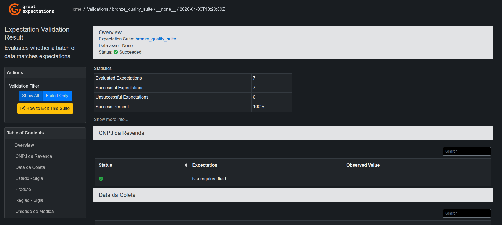
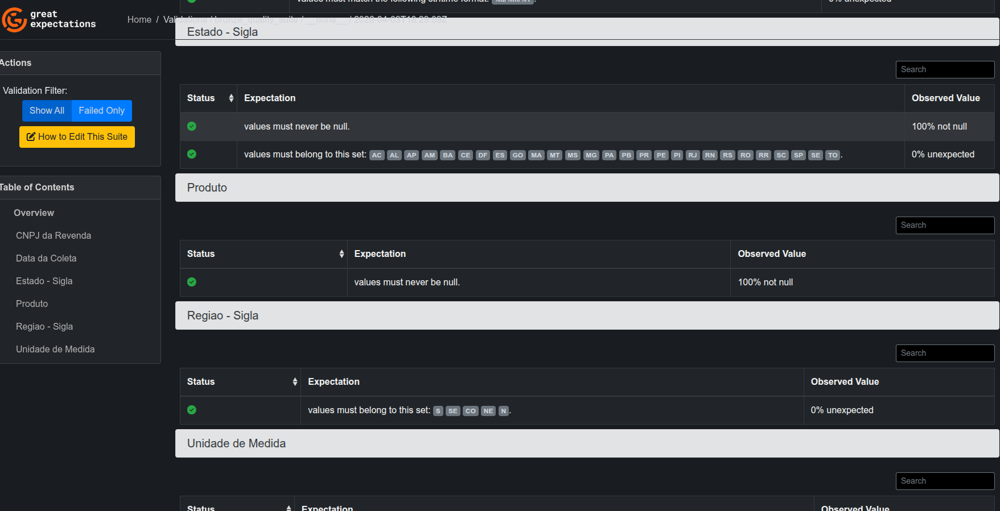
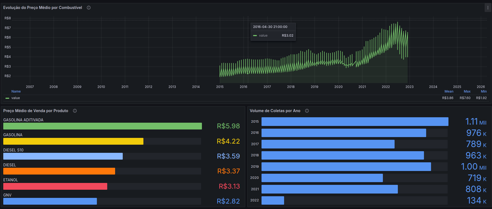
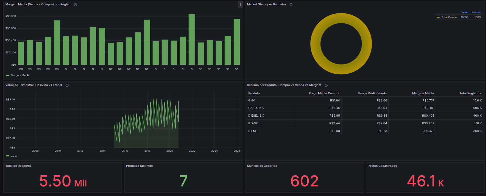

# Lab01 PART2 — Pipeline de Preços de Combustíveis (ANP)

Pipeline ETL completo que extrai dados semestrais de preços de combustíveis da ANP,
aplica transformações (Bronze → Silver → Gold) e carrega em um Star Schema no PostgreSQL,
com validação de qualidade via Great Expectations e visualização via Grafana.

---

## Arquitetura

```
CSV (ANP)  →  Bronze (raw)  →  Silver (parquet)  →  Gold (PostgreSQL Star Schema)
                  ↓                                          ↓
          Great Expectations                            Grafana BI
           (Data Quality)                          (Dashboards automáticos)
```

### Star Schema (Gold)

| Tabela | Tipo | Descrição |
|---|---|---|
| `fact_precos_combustivel` | Fato | Preços de venda e compra por coleta |
| `dim_data` | Dimensão | Data, ano, mês, trimestre |
| `dim_produto` | Dimensão | Produto e unidade de medida |
| `dim_localidade` | Dimensão | Região, estado e município |
| `dim_posto` | Dimensão (SCD Type 2) | Revenda, CNPJ, bandeira, endereço |

---

## Pré-requisitos

- **Docker** e **Docker Compose** instalados
- Portas livres: `5432` (PostgreSQL) e `3000` (Grafana)

---

## 1. Como construir a imagem Docker

```bash
sudo docker compose build
```

Isso cria a imagem do pipeline com Python 3.12, uv e todas as dependências do `pyproject.toml`.

---

## 2. Como subir os containers

```bash
sudo docker compose up -d
```

Serviços iniciados:

| Container | Porta | Descrição |
|---|---|---|
| `postgres_dw` | 5432 | PostgreSQL 15 — Data Warehouse |
| `pipeline_app` | — | Executa o ETL (extração → gold) |
| `grafana` | 3000 | Grafana 11.6.0 — Dashboards pré-configurados |

Para acompanhar os logs do pipeline:

```bash
sudo docker compose logs -f pipeline_app
```

Para parar tudo:

```bash
sudo docker compose down -v
```

---

## 3. Como executar as validações do Great Expectations

As validações são executadas **automaticamente** como parte do pipeline (etapa "Quality"
entre Load e Transform). O validator roda sobre a camada Bronze (CSVs raw) com 7 expectations:

| # | Expectativa | Coluna |
|---|---|---|
| 1 | `ExpectColumnValuesToNotBeNull` | Estado - Sigla |
| 2 | `ExpectColumnValuesToNotBeNull` | Produto |
| 3 | `ExpectColumnValuesToMatchStrftimeFormat` | Data da Coleta (`%d/%m/%Y`) |
| 4 | `ExpectColumnValuesToBeInSet` | Estado - Sigla (27 UFs) |
| 5 | `ExpectColumnValuesToBeInSet` | Unidade de Medida |
| 6 | `ExpectColumnToExist` | CNPJ da Revenda |
| 7 | `ExpectColumnValuesToBeInSet` | Regiao - Sigla (S, SE, CO, NE, N) |

### Relatório HTML (Data Docs)

Após a execução, os Data Docs são gerados em:

```
data/gx/gx/uncommitted/data_docs/local_site/index.html
```

Abra no navegador para visualizar o relatório de validação.

---

## 4. Dashboard — Grafana (automático)

O dashboard é **provisionado automaticamente** — basta subir os containers e acessar:

1. Acesse [http://localhost:3000](http://localhost:3000)
2. Login: `admin` / `admin`
3. O dashboard **"Preços de Combustíveis - ANP (Gold)"** já estará na home

> Não é necessário configurar datasource nem criar visualizações manualmente.
> Tudo é carregado via provisioning (arquivos em `infra/grafana/`).

### Visualizações do Dashboard

| # | Painel | Tipo de Gráfico | Insight |
|---|---|---|---|
| 1 | Evolução do preço médio por combustível | Time Series (Linhas) | Tendência de preços ao longo dos anos |
| 2 | Preço médio de venda por produto | Barras Horizontais | Ranking de combustíveis por preço |
| 3 | Volume de coletas por ano | Barras Verticais | Distribuição temporal da base de dados |
| 4 | Margem média (venda − compra) por região | Barras Agrupadas | Margem do posto por região e combustível |
| 5 | Market share por bandeira | Donut (Pizza) | Concentração de mercado por bandeira |
| 6 | Variação trimestral: Gasolina vs Etanol | Time Series (Linhas) | Sazonalidade e competição |
| 7 | Resumo por produto: compra vs venda vs margem | Tabela | Comparativo detalhado por produto |
| 8–11 | KPIs: Total registros, Produtos, Municípios, Postos | Stat | Indicadores resumo |

---

## Etapas do Pipeline

O pipeline é orquestrado pelo `src/pipeline/pipeline.py` e segue a ordem:

1. **Extract** — Baixa CSVs semestrais da ANP (2004–2025)
2. **Load** — Salva na camada Bronze (`data/bronze/`)
3. **Quality** — Valida com Great Expectations (7 expectations)
4. **Transform Silver** — Limpeza, dedup, normalização → Parquet particionado por ano (`data/silver/`)
5. **Transform Gold** — Carrega dimensões e fato no PostgreSQL (Star Schema)
   - Staging `UNLOGGED TABLE` com `SERIAL` para paginação eficiente
   - Bulk INSERT por faixa de IDs (sem OFFSET)
   - Índices da fato removidos durante carga e recriados ao final

---

## Estrutura do Projeto

```
├── docker-compose.yaml          # Orquestração dos containers
├── dockerfile                   # Imagem do pipeline (Python 3.12 + uv)
├── pyproject.toml               # Dependências Python
├── .env                         # Variáveis de ambiente
├── .dockerignore                # Exclui data/, .venv/ do build context
├── data/
│   ├── bronze/                  # CSVs raw da ANP
│   ├── silver/                  # Parquets particionados por ano
│   └── gx/                      # Great Expectations (context + data docs)
├── images/                      # Screenshots do dashboard e pipeline
├── infra/
│   ├── grafana/
│   │   ├── provisioning/        # Datasource + dashboard provider (YAML)
│   │   └── dashboards/          # Dashboard JSON (provisionado automaticamente)
│   ├── metabase_dashboard_queries.sql  # Queries SQL de referência
│   └── repositories/            # DuckDB temporário
├── src/
│   ├── main.py                  # Entrypoint
│   ├── pipeline/pipeline.py     # Orquestrador do ETL
│   ├── data_sources/            # URLs da ANP
│   ├── extract/                 # Extração de URLs e download
│   ├── quality/validator.py     # Great Expectations (7 expectations)
│   ├── transform/
│   │   ├── silver/              # Bronze → Silver (DuckDB: limpeza + dedup)
│   │   └── gold/                # Silver → Gold (PostgreSQL: star schema)
│   └── utils/                   # Conexões DB (DuckDB + PostgreSQL)
└── tests/unit/                  # Testes unitários
```

---

## Screenshots

### Dashboard Grafana — Visão geral



### Dashboard Grafana — Painéis adicionais



### Pipeline — Execução no Docker


